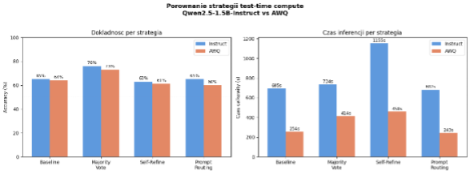
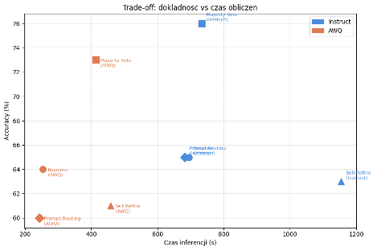

# Mini_reasoner
Implementacja modelu Qwen2.5-1.5B-Instruct oraz wersji AWQ w celu przetestowania skuteczności modelu na zbiorze danych GSM8K.

**Zadanie rekrutacyjne**

# Opis zbioru danych

Do testow uzylem zbioru GSM8K (Grade School Math 8K) udostępnionego na Hugging Face. Jest to zestaw 8500 zadań matematycznych na poziomie szkoły podstawowej, gdzie każde zadanie wymaga kilku kroków rozumowania.

Wybrałem 100 zadan z test splitu (pierwsze 100 probek). Odpowiedź docelowa jest zakodowana po znaczniku ' #### ' w polu answer. Przy wczytywaniu danych usuwam przecinki z liczb (np. 1,000 zamieniam na 1000), bo inaczej porównanie stringów dawało fałszywe negatywy.

# Opis zaimplementowanych strategii

## Baseline (greedy decoding)

Najprostsza możliwa strategia - model dostaje pytanie i generuje jedna odpowiedź przy temperature=0 (greedy decoding). Prompt do generowania odpowiedzi przez model: "Solve the math problem step by step. End with: Final answer: &lt;number&gt;". Każdy token jest wybierany deterministycznie jako najbardziej prawdopodobny. Baseline służy jako punkt odniesienia dla pozostałych strategii.

## Majority Vote (Self-Consistency, n=10)

Zamiast jednej odpowiedzi generujemy 10 rożnych odpowiedzi (n=10, temperature=0.7) i wybieramy tą, która pojawia się najczęściej. Intuicja jest prosta: błędy modelu są losowe i rożnorodne, ale poprawna odpowiedż pojawia sie konsekwentnie w większosci prob. Przy n=10 vLLM przetwarza całe 10 odpowiedzi w jednym batchu, co tłumaczy dlaczego czas nie wzrosl 10-krotnie względem baseline. Prompt pytający jest ten sam jak w zadaniu Baseline.

## Self-Refine

Dwuetapowa strategia: model najpierw generuje odpowiedź, a nastepnie dostaje ją z powrotem razem z pytaniem i jest proszony o sprawdzenie krok po kroku, czy gdzies nie popelnił błędu. Jeśli znajdzie błąd, ma go poprawić i podać nową odpowiedź. Każde zadanie to wiec dwa osobne zapytania do modelu. Prompt pytający jest ten sam jak w zadaniu Baseline, dodatkowy prompt na sprawdzenie popełnienia błędu przez model: "Check every calculation step carefully. If you find a mistake, correct it. ", "End with: Final answer: &lt;number&gt;".

## Prompt Routing (wlasna strategia)

Mój własny pomysł wraz ze wsparciem Gemini, przed wysłaniem zapytania do modelu klasyfikuje typ zadania na podstawie słów kluczowych i dobiera dedykowany prompt. Zamiast jednego ogólnego promptu jak we wcześniejszych zadaniach, każda kategoria dostaje instrukcje dopasowane do swojej struktury.

| **Kategoria** | **Slowa kluczowe**                  |     | **Dedykowany prompt**                                                                                                                                                                                    |
| ------------- | ----------------------------------- | --- | -------------------------------------------------------------------------------------------------------------------------------------------------------------------------------------------------------- |
| percentage    | percent, %, discount, tax           |     | "You are solving a percentage problem. Steps: "  "1) identify the base value,  2) find the percentage amount,  3) compute the result. "  "End with: Final answer: &lt;number&gt; |
| rate_time     | speed, mph, per hour, distance      |     | "You are solving a rate/speed/time problem. "  "Use distance = speed × time or its variants. "  "End with: Final answer: &lt;number&gt;"                                                     |
| Comparison    | more than, less than, how many more |     | "You are solving a comparison problem. "  "Compute each quantity separately, then find the difference or ratio. "  "End with: Final answer: &lt;number&gt;"                                  |
| multi_step    | first... then..., after             |     | "This problem has multiple steps. Number each sub-problem, solve them in order, "  "then combine results. End with: Final answer: &lt;number&gt;"                                                  |
| default       | wszystko inne                       |     | "Solve the math problem step by step. End with: Final answer: &lt;number&gt;"                                                                                                                            |

Tabela 1. Kategorie zadan i odpowiadajace im prompty.

Motywacja: małe modele (1.5B parametrow) sa bardzo wrażliwe na sformułowanie promptu. Dla zadań procentowych ogólny prompt często pomijał etap identyfikacji wartości bazowej, co prowadziło do błędów. Dedykowany prompt narzuca wymaganą kolejność krokow.

# Moje myslenie i decyzje projektowe

## Wybor modelu

Pierwotnie chcialem uzyc Qwen2.5-7B-Instruct zgodnie z rekomendacjami w zadaniu. Niestety na Google Colab z GPU T4 (15 GB VRAM) model 7B konsekwentnie wywolywał bledy OOM (out of memory). Sprobowalem tez Llama-3.2-3B-Instruct, oraz Gemma-2-9B-it oraz niższe wersje, jednak bez skutku problem z załadowaniem modelu nie znikały. Postanowiłem więc wykonać testy na mniejszym modelu, ale żeby były one chociaż zrobione. Niestety ze względu na brak doświadczenia w tym temacie sprawiło mi to dużo problemów i zmarnowanego czasu.

Ostatecznie wybralem Qwen2.5-1.5B-Instruct miesci sie w pamieci, dziala odpowiednio szybko i jest dostepna wersja AWQ do testow kwantyzacji. Wyniki sa nizsze niz dla wiekszych modeli, ale logika strategii jest ta sama.

## Wybor zbioru danych

Wybrałem zbiór danych GSM8K ponieważ, jest on chyba najpopularniejszym benchmarkiem dla rozumowania matematycznego i ma prosta strukture odpowiedzi (liczba po ####). Widziałem kilka razy gdzieś testy różnych modeli ze statystykami, więc go zapamiętałem i dlatego podjąłem taki wybór.

## Problemy napotkane po drodze

**Implementacja modelu** - tak jak wspomniałem wcześniej, największe problemy były z implementacją modelu. Ostatecznie załadowałem model za pomocą serwera vLLM, nie wiem szczerze na ile jest to poprawnie, w wymaganiach było transformer + vLLM, ale w momencie gdy mi się udało przez vLLM, nie chciałem dalej grzebać w tym, ze względu na czas oraz strach przed zapsuciem czegoś.

**Ograniczenia Colab** - dodatkowo w połowie prowadzenia testów po uporaniu się ze wszystkimi problemami, skończyły mi się limity na Colabie :/ . Na szczęście posiadam jakiś dodatkowy gmail, więc cały proces przerzuciłem tam, kopiując notebook.

**Parsowanie odpowiedzi** - duzo czasu spedzalem na debug'owaniu dlaczego accuracy byl nizszy niz oczekiwalem. Okazalo sie ze porownanie stringow '4' != '4.0' dawalo falszywe negatywy. Naprawilem to normalizujac obie wartosci przez float. Dodatkowo trzeba było dodać całkiem skomplikowaną funkcje do szukania odpowiedzi

def extract_number(text):

match = re.search(r"\[Ff\]inal\\s+answer\\s\*\[:\\-\]?\\s\*(\[\\d,\\.\]+)", text)

if match:

return match.group(1).replace(",", "")

\# jak nie ma "final answer" to bieremy ostatnia liczbe ktora znajdziemy

all_numbers = re.findall(r"\[-+\]?\\d\[\\d,\]\*\\.?\\d\*", text)

if all_numbers:

return all_numbers\[-1\].replace(",", "")

return None

Osobiście nie wpadłbym na taki pomysł, więc z tym problemem pomógł mi Gemini, ja dość prymitywnie na początku jedynie szukałem liczby od końca co nie było dobrym pomysłem.

**Continuous batching i Majority Vote** - nie rozumialem dlaczego Majority Vote (n=10) trwa tylko troche dluzej niz baseline zamiast 10x dluzej. Okazalo sie ze vLLM przetwarza wszystkie 10 odpowiedzi rownolegle w jednym wywolaniu dzieki continuous batching - to jest wlasnie ta funkcja vLLM ktora miala byc testowana.

**Self-Refine gorszy niz oczekiwalem** - spodziewalem sie poprawy, ale model 1.5B czesto zatwierdzał błędy zamiast je poprawiać. Dla większego modelu efekt byłby zapewne lepszy.

## Prompt Routing - co dzialalo a co nie

Kategoria 'comparison' osiagnęła 100% accuracy (6/6), co potwierdziło że dedykowany prompt rzeczywiście pomaga. Natomiast 'rate_time' wypadła słabo (38% Instruct, 50% AWQ) - zadania z prędkością są trudne dla małego modelu nawet z dopasowanym promptem. Kategoria 'percentage' tez nie wypadła świetnie (47%), co wskazuje że słowa kluczowe ('percent', '%') nie zawsze dobrze identyfikują typ zadania.

# Wyniki eksperymentow

## Accuracy i czas inferencji

| **Strategia**  | **Accuracy**  **Instruct** | **Accuracy**  **AWQ** | **Czas**  **Instruct (s)** | **Czas AWQ (s)** | **Tokeny**  **Instruct** | **Tokeny**  **AWQ** |
| -------------- | -------------------------------- | --------------------------- | -------------------------------- | ---------------- | ------------------------------ | ------------------------- |
| Baseline       | 65%                              | 64%                         | 695                              | 254              | 30 321                         | 29 505                    |
| Majority Vote  | 76%                              | 73%                         | 734                              | 414              | 287 775                        | 292 566                   |
| Self-Refine    | 63%                              | 61%                         | 1155                             | 458              | 50 140                         | 51 909                    |
| Prompt Routing | 65%                              | 60%                         | 682                              | 243              | 29 847                         | 28 447                    |

Tabela 2. Porownanie wszystkich strategii na 100 zadaniach GSM8K

Wykres 1. Porównanie strategii test-time compute

Wykres 2. Dokładność vs Czas obliczeń

## Throughput (tokeny na sekunde)

| **Strategia**  | **Throughput Instruct**  **(tok/s)** | **Throughput AWQ**  **(tok/s)** | **Przyspieszenie AWQ** | **Zmiana accuracy** |
| -------------- | ------------------------------------------ | ------------------------------------- | ---------------------- | ------------------- |
| Baseline       | 43.7                                       | 116.0                                 | 2.73x                  | \-1%                |
| Majority Vote  | 392.1                                      | 706.7                                 | 1.77x                  | \-3%                |
| Self-Refine    | 43.4                                       | 113.4                                 | 2.52x                  | \-2%                |
| Prompt Routing | 43.8                                       | 117.1                                 | 2.81x                  | \-5%                |

Tabela 3. Throughput i przyspieszenie AWQ wzgledem modelu bazowego.

Throughput dla Majority Vote jest ok. 9x wyzszy niż dla pozostałych strategii (392 vs ~44 tok/s dla Instruct). Wynika to z tego ze n=10 oznacza ze vLLM przetwarza jednoczesnie 10 sekwencji w jednym batchu - GPU jest w tym czasie w pełni załadowane. Pozostałe strategie wysyłają po jednym zapytaniu, więc GPU czeka na każdy token z osobna. Kwantyzacja AWQ pozwoliła na **2-krotne** zwiększenie przepustowości (z 60,7 do 121,3 tok/s), co czyni ją kluczową techniką przy ograniczonych zasobach GPU.

## Prompt Routing - wyniki per kategoria

| **Kategoria** | **Liczba zadan** | **Poprawne**  **(Instruct)** | **Accuracy**  **(Instruct)** | **Poprawne**  **(AWQ)** | **Accuracy**  **(AWQ)** |
| ------------- | ---------------- | ---------------------------------- | ---------------------------------- | ----------------------------- | ----------------------------- |
| comparison    | 6                | 6                                  | 100%                               | 5                             | 83%                           |
| default       | 64               | 45                                 | 70%                                | 44                            | 69%                           |
| multi_step    | 3                | 2                                  | 67%                                | 1                             | 33%                           |
| percentage    | 19               | 9                                  | 47%                                | 6                             | 32%                           |
| rate_time     | 8                | 3                                  | 38%                                | 4                             | 50%                           |

Tabela 4. Wyniki Prompt Routing per kategoria zadania.

# Wnioski

## Kiedy strategie dzialaja lepiej

**Majority Vote** to zdecydowanie najlepsza strategia pod wzgledem accuracy (+11pp wzgledem baseline dla Instruct). Działa dobrze wtedy, gdy model czasem popełnia błędy, ale zna poprawną metode - większość z 10 prób daje poprawną odpowiedź. Koszt jest jednak wysoki ~10x więcej tokenów.

**Prompt Routing** to najlepsza strategia pod względem efektywnosci - taka sama dokładność jak Baseline (65%), ale przy minimalnym nakładzie obliczeniowym (29 847 tokenow vs 30 321 dla baseline, czas nawet krótszy). Dla zadań typu 'comparison' osiagnęła 100%, co pokazuje że dedykowany prompt realnie pomaga.

**Self-Refine** okazała sie najsłabszą strategią - gorsza od baseline (63% vs 65%) i zdecydowanie najwolniejsza (1155s). Model 1.5B nie ma wystarczającej zdolności do krytycznej oceny własnych odpowiedzi.

## Kiedy strategie dzialaja gorzej

14 zadan nie zostalo rozwiazanych przez żadną strategie. Są to zazwyczaj zadania wymagajace bardzo długiego lańcucha rozumowania (model obcina odpowiedz przy max_tokens) lub zadania z niestandardowym formatem liczb. Przykladem jest zadanie z pobieraniem pliku 200 GB gdzie trzeba zsumować wiele etapow z obliczeniami procentowymi - mode gubi sie przy tak dlugim kontekście obliczeń.

## Wpływ kwantyzacji AWQ

AWQ przyspiesza inferencje 2-3x przy stracie 1-5% accuracy. Najlepszy stosunek przyspieszenia do straty accuracy ma Baseline (2.73x, -1pp) i Self-Refine (2.52x, -2pp). Dla Prompt Routing strata jest wieksza (-5pp), co sugeruje że mały model AWQ jest bardziej wrażliwy na zmiane systemu promptow.
